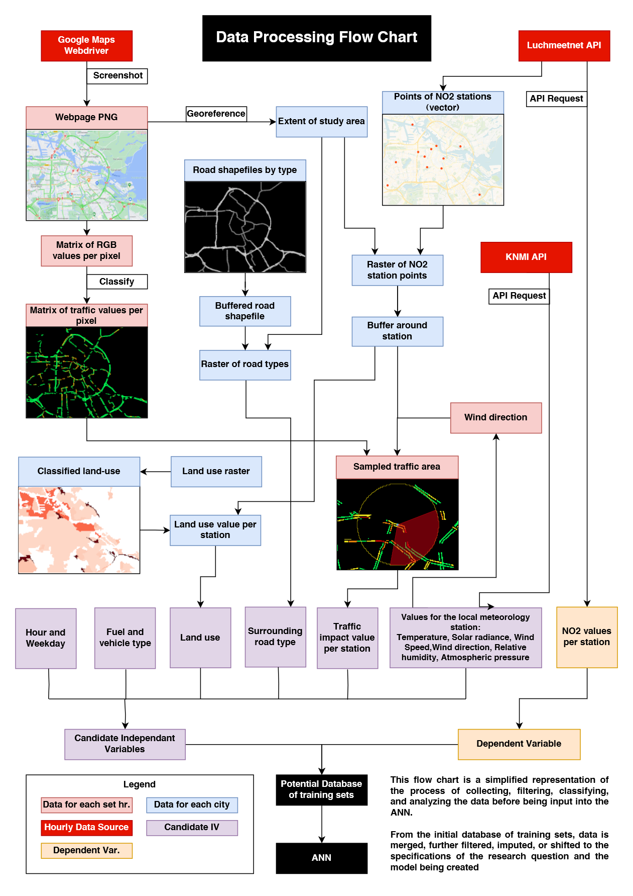

# Bachelor's thesis: Evaluating the Transferability of a Real-Time Global Traffic Data Source for Urban NO2 Regression Models

This repository is a collection of the some of the critical scripts I wrote for the methodology of my Bachelor's thesis **(Nov 2022 - June 2023)**.
This was my first programming project (outside of small projects like making a calculator) where I learned python as I developed the code.
In the process of developing what I needed for my thesis, file naming conventions were low priority and many scripts were created for small parts of the methodology.
Because of this, much of the code needed to replicate my thesis is unable to find and organize as I upload this two years later.

However, I still want to have a place to keep some of the big parts which I was very proud of making at the time.
**hourly_data_collector.py** is what I spent the most time on. It scrapes Google Maps Traffic Data, and collects meteorology and NO2 concentration data every hour.
**traffic_image_processor.py** processes the raw screenshot I collected in hourly collector into classes of traffic intensity.
**traffic_buffer_collector.py** calculates the wind-sector buffers used in as independant values in the land use regression model.
**model_predictor.py** prepares my independant and dependant values and uses sklearn's MLP to predict and evaluate the accuracy of my models.

The entire thesis can be read in **thesis.pdf** and an overview of the methodology can be seen here:

